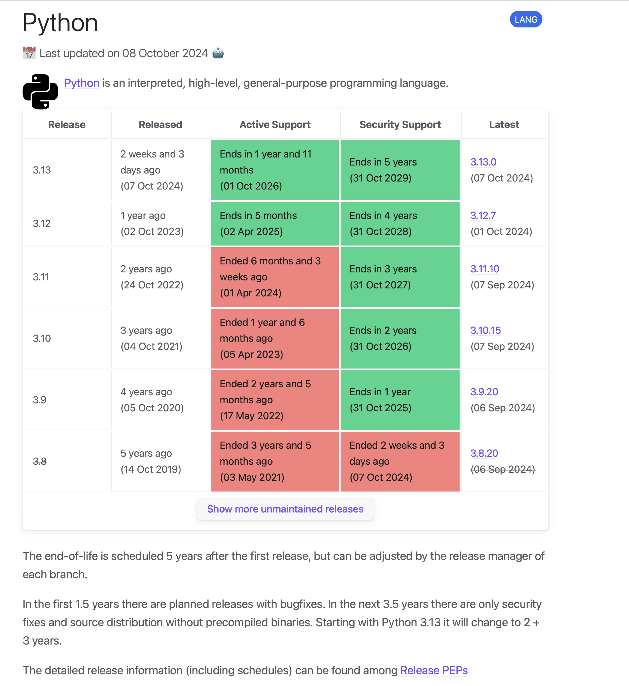

[endoflife.date](https://endoflife.date) is an informational website that tracks support cycles and release schedules of over 340 products.

Not all product websites can easily answer the question: "How long is this product supported?" We track it, and showcase exact dates along with a concise summary of the release policy. Here's a screenshot of how it looks:

The complete website is open-source, and we are always working to make it better.

We are more than 6 years old, and around 500 contributors:

If you'd like to support the project, check out our [list of open issues](https://github.com/endoflife-date/endoflife.date/issues?q=is%3Aissue+is%3Aopen+sort%3Aupdated-desc). We're on [GitHub Sponsors](https://github.com/sponsors/endoflife-date) and [Open Collective](https://opencollective.com/endoflife-date)

We have a special issue for [Hacktoberfest Participants](https://github.com/endoflife-date/endoflife.date/issues/408). :tada:
